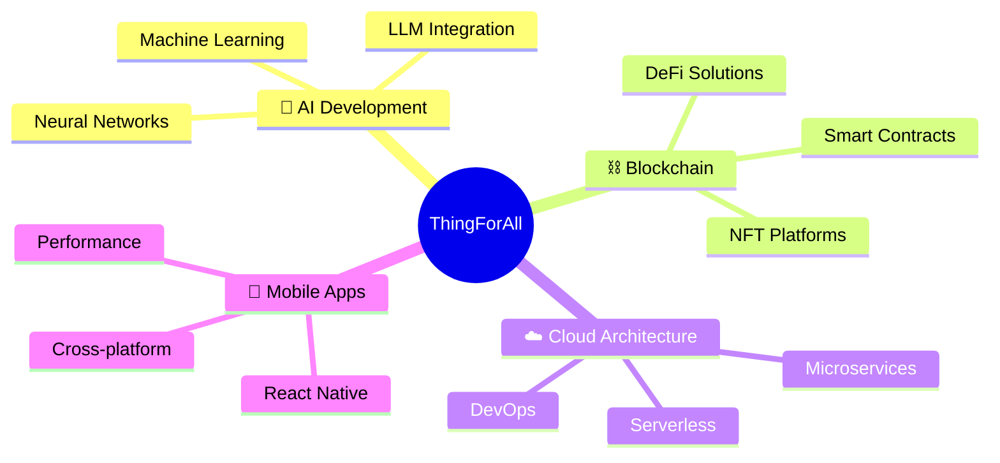

# 🏆 ThingForAll - Trophy Premium Collection 🏆

<div align="center">


[](https://github.com/ryo-ma/github-profile-trophy)

</div>

---

## ✨ About Me


```javascript
const thingForAll = {
    title: "Premium Developer",
    location: "🌍 Global",
    code: ["JavaScript", "TypeScript", "Python", "Solidity"],
    technologies: {
        frontEnd: ["React", "Next.js", "Vue", "Tailwind"],
        backEnd: ["Node.js", "Express", "Django", "FastAPI"],
        mobile: ["React Native", "Flutter"],
        blockchain: ["Ethereum", "Web3.js", "Smart Contracts"],
        cloud: ["AWS", "GCP", "Azure", "Docker", "Kubernetes"],
        database: ["MongoDB", "PostgreSQL", "Redis", "Firebase"],
        ai_ml: ["TensorFlow", "PyTorch", "OpenAI", "LangChain"]
    },
    status: "🔥 Building the Future",
    achievement: "🏆 Trophy Premium Portfolio"
};
```

<br clear="right"/>

---

## 📊 Premium Statistics

<div align="center">
  


</div>

---

## 🚀 Featured Premium Projects

<div align="center">

| 🎯 Project | 💻 Tech Stack | ⭐ Stars | 🔗 Link |
|-----------|--------------|---------|---------|
| **Quantum Cloud Platform** | React • Node.js • AWS • K8s |  | [View](https://github.com/thingforall) |
| **AI Neural Network Suite** | Python • TensorFlow • Docker |  | [View](https://github.com/thingforall) |
| **Blockchain FinTech App** | Solidity • Web3 • Next.js |  | [View](https://github.com/thingforall) |

</div>

<div align="center">

[](https://github.com/thingforall/quantum-cloud)
[](https://github.com/thingforall/ai-neural-suite)

</div>

---

## 🛠️ Premium Tech Stack

<div align="center">

### Frontend Development


### Backend Development


### Mobile Development


### Cloud & DevOps


### Database


### Blockchain & Web3


### AI & Machine Learning


</div>

---

## 📈 Contribution Graph

<div align="center">


</div>

---

## 🎯 Current Focus

<div align="center">


```mermaid
mindmap
  root((ThingForAll))
    🤖 AI Development
      Machine Learning
      Neural Networks
      LLM Integration
    ⛓️ Blockchain
      Smart Contracts
      DeFi Solutions
      NFT Platforms
    ☁️ Cloud Architecture
      Microservices
      Serverless
      DevOps
    📱 Mobile Apps
      React Native
      Cross-platform
      Performance
```

</div>

---

## 🏆 GitHub Achievements

<div align="center">


</div>

---

## 💼 Professional Services

<div align="center">

| Service | Description | Status |
|---------|-------------|--------|
| 🎨 **UI/UX Design** | Premium interface design & prototyping | ✅ Available |
| 💻 **Full-Stack Development** | End-to-end web & mobile solutions | ✅ Available |
| ⛓️ **Blockchain Development** | Smart contracts & DApp creation | ✅ Available |
| 🤖 **AI Integration** | Machine learning & AI solutions | ✅ Available |
| ☁️ **Cloud Architecture** | Scalable infrastructure design | ✅ Available |
| 🔧 **Technical Consulting** | Architecture & code reviews | ✅ Available |

</div>

---

## 📫 Connect With Me

<div align="center">

[](https://thingforall.dev)
[](https://linkedin.com/in/thingforall)
[](https://twitter.com/thingforall)
[](mailto:contact@thingforall.dev)
[](https://discord.gg/thingforall)
[](https://t.me/thingforall)

<br/>


</div>

---

## 💝 Support My Work

<div align="center">

If you find my projects helpful, consider supporting me:

[](https://buymeacoffee.com/thingforall)
[](https://paypal.me/thingforall)
[](https://ko-fi.com/thingforall)

</div>

---

<div align="center">

### 🌟 "Building tomorrow's technology, today" 🌟


**⭐ Star my repositories if you find them useful!**


---

© 2025 ThingForAll - Elite Digital Solutions | All Rights Reserved

</div>